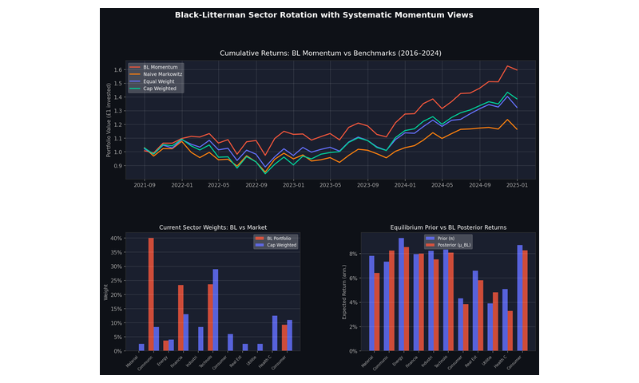
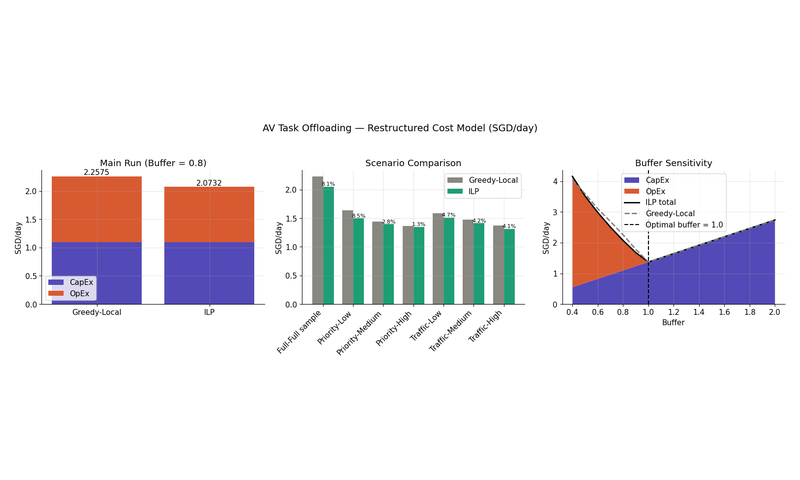
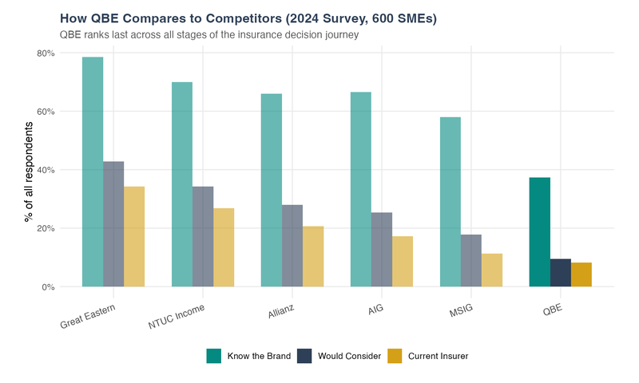
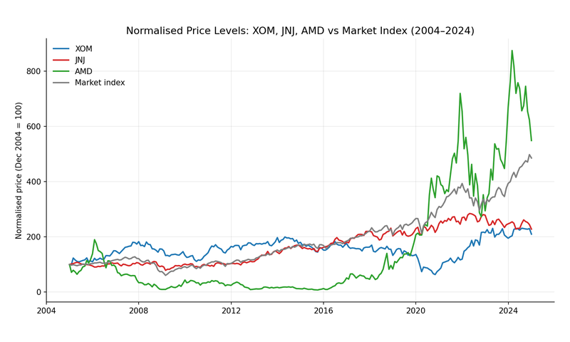
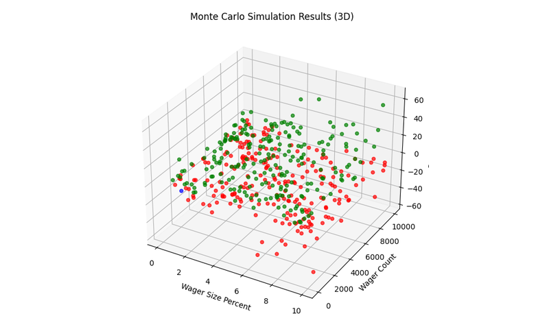
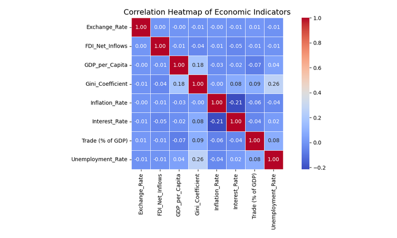
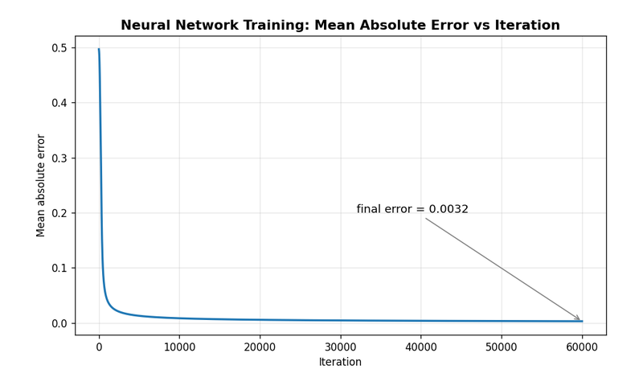

# GitHub Portfolio

I'm Lewis Dang, a student at Loughborough University with an exchange year completed at Nanyang Technological University, Singapore. I am studying Economics and Management with a focus on financial risk and derivatives. My interests lie in Quantitative Finance, Investment Risk, Portfolio Analytics, and Optimisation. I hope you enjoy my portfolio!

## Projects

<table>
<tr>
<td align="center" width="33%">
<a href="https://github.com/l3wisdang/black-litterman-sector-rotation"><b>Black-Litterman Sector Rotation</b></a> 
(2026) 
<i>Python, Black-Litterman, Streamlit, scikit-learn</i>
</td>
<td align="center" width="33%">
<a href="https://github.com/l3wisdang/Autonomous-Vehicle-Task-offloading-optimisation"><b>Autonomous Vehicle Task Offloading</b></a> 
(Sep-Nov 2025) 
<i>Python, Gurobi, Integer Linear Programming</i>
</td>
<td align="center" width="33%">
<a href="https://github.com/l3wisdang/QBE-Insurance-analytics"><b>QBE SME Insurance Analytics</b></a> 
(2026) 
<i>R, Quarto, Logistic Regression, XGBoost + SHAP</i>
</td>
</tr>
<tr>
<td align="center"></td>
<td align="center"></td>
<td align="center"></td>
</tr>
<tr>
<td align="center" width="33%">
<a href="https://github.com/l3wisdang/portfolio-risk-return-analysis"><b>Optimal Portfolio Construction & Risk-Return Analysis</b></a> 
(2025) 
<i>Excel, Sharpe Ratio, CAPM, Solver Optimisation</i>
</td>
<td align="center" width="33%">
<a href="https://github.com/l3wisdang/monte-carlo-risk-of-ruin"><b>Monte Carlo Risk of Ruin</b></a> 
(2026) 
<i>Python, Monte Carlo Simulation, Risk Analysis</i>
</td>
<td align="center" width="33%">
<a href="https://github.com/l3wisdang/economic-indicators-analysis"><b>Global Economic Indicators Analysis</b></a> 
(2025) 
<i>Python, pandas, Time Series, World Bank Data</i>
</td>
</tr>
<tr>
<td align="center"></td>
<td align="center"></td>
<td align="center"></td>
</tr>
<tr>
<td align="center" width="33%"></td>
<td align="center" width="33%">
<a href="https://github.com/l3wisdang/Neural-Network-from-scratch"><b>Neural Network from Scratch</b></a> 
(2026) 
<i>Python, NumPy, Backpropagation, Gradient Descent</i>
</td>
<td align="center" width="33%"></td>
</tr>
<tr>
<td align="center"></td>
<td align="center"></td>
<td align="center"></td>
</tr>
</table>

Additional research experience, internships, and coursework can be found on my [LinkedIn page](https://www.linkedin.com/in/l3wisdang/).

## Technical skills

| Programming Languages | Finance & Markets |
|---|---|
| *Python, R, SQL* | *Derivatives pricing & hedging, portfolio construction, financial risk analytics (VaR, GARCH), DCF/WACC valuation, Bloomberg Market Concepts* |
| **Libraries & Tools** | **Methods** |
| *pandas, NumPy, scikit-learn, matplotlib, gurobipy, tidyverse, Quarto, Streamlit, Excel (Advanced), Git* | *Optimisation (linear, integer & portfolio), Black-Litterman, Monte Carlo simulation, logistic regression & statistical inference, time series analysis, machine learning (XGBoost, SHAP, neural networks)* |

## Contact

Feel free to reach out with questions about my work or experience. Please email if you would like a copy of my CV.

📧 lewisdangplacements *at* gmail *dot* com
